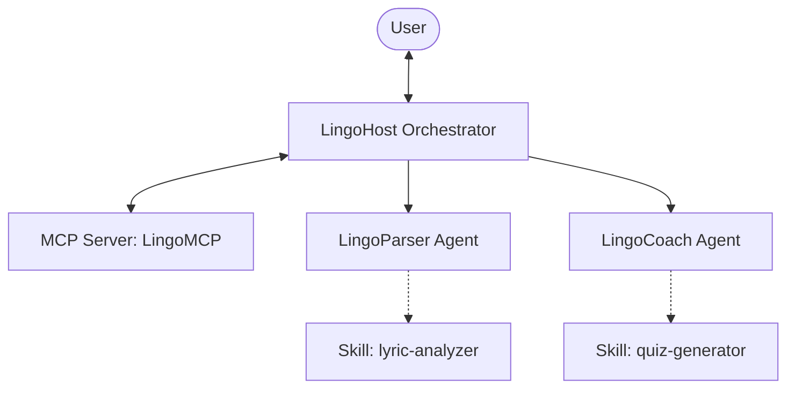

# LingoKaraoke & CinemaLingo (Track: Agents for Good - Education)

An interactive, multi-agent foreign language tutoring system built with the **Google Antigravity SDK** (ADK) and **gemini-agents-cli** skills. The project matches the **Agents for Good** track (Advancing Education) by helping users learn foreign languages (specifically Spanish) through their favorite song lyrics (Karaoke) and movie dialogues (Cinema).

---

## 🏗️ Architecture & Multi-Agent Design

The system implements a cooperative multi-agent architecture with three specialized agents:



1. **LingoHost (Orchestrator)**: Main entry point. Greets the user, retrieves their profile, searches the database for songs/scenes, and coordinates lesson handoffs.
2. **LingoParser (Segmentation Sub-agent)**: Segment dialogues or lyrics line-by-line, translations, and selects focus vocabulary using the `lyric-analyzer` Skill.
3. **LingoCoach (Quiz & Vocabulary Sub-agent)**: Explains the grammar context, generates interactive quizzes using the `quiz-generator` Skill, evaluates user answers, and logs learned words to their flashcard deck.

---

## 🌟 Core Concepts Implemented

### 1. Custom Stdio MCP Server (`mcp_server.py`)
Built using FastMCP to connect agents to a local SQLite database (`lingo_database.db`). Exposes tools:
* `get_user_profile(user_id)`: Fetches target language and skill levels.
* `search_learning_media(query, language)`: Searches matching songs/scenes.
* `get_media_content(content_id)`: Fetches verses/dialogues.
* `add_vocabulary_word(word, translation, context)`: Adds words to spaced-repetition deck.
* `delete_vocabulary_word(word)`: Clears a card.
* `reset_vocab_deck()`: Resets learner progress.

### 2. Modular Agent Skills (`.agents/skills/`)
Implements procedural knowledge and templates:
* **`lyric-analyzer`**: Splitting dialogues/lyrics, generating phonetic guides, and launching `scripts/phonetic_generator.py` for Spanish pronunciation conversion.
* **`quiz-generator`**: Gherkin-aligned instructions for producing fill-in-the-blank, multiple-choice, and translation quizzes.

### 3. Vibe Diff Safety Hook (`app/agent.py`)
Intercepts high-stakes database modifications (`add_vocabulary_word`, `delete_vocabulary_word`, `reset_vocab_deck`) and directory traversal attempts:
* Displays a **Vibe Diff** summary highlighting the requested change.
* Prompt for terminal confirmation: `Do you approve this database change? (y/N)`.
* Automatically bypasses interactive prompts in non-interactive (automated test) environments to prevent execution hangs.

---

## 🚀 Quick Start & Local Run

### Prerequisites
* **uv**: Python package manager.
* **agents-cli**: Google Agents CLI (`uv tool install google-agents-cli`).

### Setup & Installation
1. Initialize the SQLite database with sample Spanish songs ("La Bamba", "De Música Ligera") and movie dialogues ("Pan's Labyrinth", "Roma"):
   ```bash
   uv run init_db.py
   ```
2. Start the interactive console playground:
   ```bash
   agents-cli playground
   ```
3. (Optional) Run the CLI directly:
   ```bash
   agents-cli run "Search for La Bamba and start practicing it"
   ```

---

## 🧪 Verification & Testing

### 1. Unit Tests
Run database and MCP server tool unit tests with pytest:
```bash
uv run pytest tests/unit/test_mcp_server.py
```

### 2. Trajectory Evaluations
Run the ADK evaluation suite to test greeting flows, search routing, and vocabulary logging:
```bash
agents-cli eval run --evalset tests/eval/evalsets/lingo_agent.evalset.json --config tests/eval/eval_config.json
```
*(All 3 evaluation cases pass with a perfect 1.0 trajectory and response quality score).*
